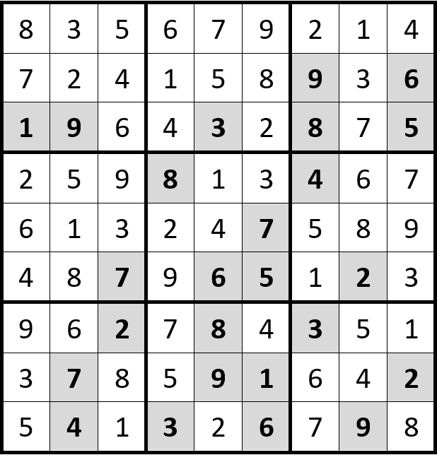

# SUDOKU-Rätsel

## 1 Einleitung

In vielen Zeitschriften finden Sie Denksportaufgaben wie das dargestellte SUDOKU-Zahlenrätsel.

Dies Spiel funktioniert wie folgt:

Der Spieler hat die Aufgabe in jedes Feld eine Zahl zwischen 1 und 9 einzusetzen die den folgenden Bedingungen genügen muss:

* Die einzusetzende Zahl darf in horizontaler Richtung in keinem weiteren Feld vorkommen.
* Die einzusetzende Zahl darf in vertikaler Richtung in keinem anderen Feld vorkommen.
* Die einzusetzende Zahl darf im dazugehörenden 3*3-Feld kein weiteres Mal vorkommen.

Damit das Rätsel begonnen werden kann, werden vom Rätselhersteller schon gewisse Felder mit Zahlen belegt (schraffierte Felder).

*Hinweis: Zahlen ohne Schraffur stellen die Lösung des Rätsel dar.*

Generell kann das Zahlenrätsel in verschiedenen Schwierigkeitsgraden hergestellt werden. So können z.B. bei einem hohen Schwierigkeitsgrad viel weniger Zahlen vorgegeben werden.

Beim leichtesten Schwierigkeitsgrad führt die Lösung immer über genau festgelegte Ablaufschritte. Dies bedeutet, dass zu keinem Abarbeitungszeitpunkt zwischen mehreren Zahlen ausprobiert werden muss. Es gibt also immer einen Weg, der die nächste Zahl vorgibt.

## 2 Aufgabenstellung

Entwickeln Sie ein Programm, welches die Lösung eines einfachen Zahlenrätsels findet. Damit das Rätsel eingegeben werden kann, muss eine geeignete Eingabemöglichkeit gefunden werden.

*Hinweis: Obiges Rätsel stellt ein einfaches SUDOKU-Zahlenrätsel dar. Um Ihre Programm zu testen, rate ich Ihnen an obiges Beispiel zu verwenden.*

## 3 Schwerpunktgebiete dieser Aufgabe

* Algorithmen
* Verwendung von mehrdimensionalen Arrays
* Verwendung von if- und switch-Kontrollstrukturen
* Verwendung verschachtelter Schlaufenstrukturen
* Verwendung von Funktionen

## 4 Geforderte Lösungsbereiche

* Struktogramm des Programms
* Programmcode in Funktionen aufgeteilt
* Algorithmen (Struktogramme) die aufzeigen, wie auch schwierige Rätsel mit dem Programm gelöst werden könnten.
* Falls genügend Zeit vorhanden, Umsetzung der obigen Lösungsvorschläge.
