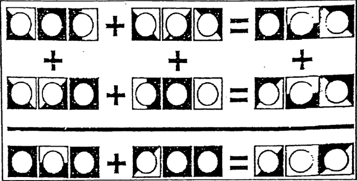

# Zahlenrätsel

## 1 Einleitung

In verschiedenen Zeitschriften werden Rätsel publiziert. In solchen Rätseln geht es darum, jedes Symbol durch eine Ziffer zu ersetzen. Dabei bedeuten gleiche Symbole auch die gleichen Ziffern. Sind alle Zahlen am richtigen Ort eingesetzt, dann müssen die horizontalen wie auch die vertikalen Rechnungen aufgehen.

## 2 Aufgabenstellung

Schreiben Sie ein C-Programm, welches obiges Zahlenrätsel lösen kann.

Folgende Richtlinien müssen dabei eingehalten werden:

* Das zu erstellende Programm soll ohne grössere Anpassungen für jedes beliebige Zahlenrätsel verwendet werden können. Dies bedeutet, dass nur die Gleichungen ersetzt werden müssen um eine neue Aufgabe zu berechnen.
* Die Gleichungen werden als Quellcode dem Programm eingegeben.
* Als Lösung wird für jedes Symbol die entsprechende Ziffer ausgegeben.

## 3 Schwerpunktgebiete dieser Aufgabe

* Schleifen, Verschachtelung von Schleifen, Schleifenabbruch
* Verwendung formatierter Ausgaben

## 4 Geforderte Lösungsbereiche

* Struktogramm des Programms
* Programmcode
