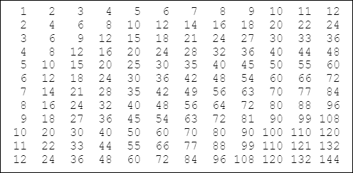

# Multiplikationstabelle

## 1 Aufgabenstellung

Erstellen Sie eine Multiplikationstabelle nach folgendem Muster:

## 2 Schwerpunktgebiete dieser Aufgabe

* Schleifenstrukturen
* Formatierte Ausgabe

## 3 Geforderte Lösungsbereiche

* Struktogramm
* Programmcode
* Selbständige Erweiterungen dieser Aufgabe
