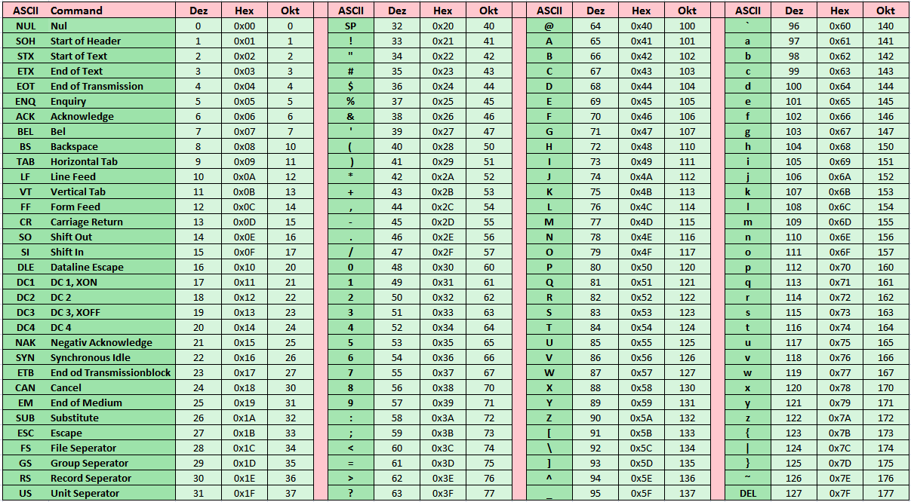

# ASCII-Zeichensatz

## 1 Einleitung

Jeder Text besteht aus einzelnen ASCII-Zeichen. Möchte man feststellen welche Zeichen dieser Zeichensatz zur Verfügung stellt, so wäre es schön ein Programm zu haben der jedes einzelne Zeichen ausgibt.

## 2 Aufgabenstellung

Entwickeln Sie ein Programm, welches alle Zeichen eines ASCII-Zeichensatzes bis zur Nummer 127 ausgibt. Beachten Sie aber, dass die Zeichen von 0-31 als Steuerzeichen verwendet werden und somit nicht ausgegeben werden sollen.

Damit die Zeichen einfach dem zugehörigen Zahlenwert zugeordnet werden können, muss die Ausgabe so gewählt werden, dass sie den folgenden Bedingungen genügt:

* Jedes Zeichen muss zusammen mit der Hexadezimal ausgegeben werden. (= 1 Einheit)
* Es sollen auf dem Bildschirm 8 Kolonnen mit den einzelnen Einheiten dargestellt werden.
* Jede Kolonne beinhaltet die Zeichen in aufsteigender Reihenfolge.
* Jeder Kolonne sollte die gleiche Länge aufweisen.

## 3 Schwerpunktgebiete dieser Aufgabe

* Verwendung von for-Schleifen
* Verwendung von if-Kontrollstrukturen
* Verwendung der formatierten Ausgabe

## 4 Geforderte Lösungsbereiche

* Struktogramm des Programms
* Programmcode
