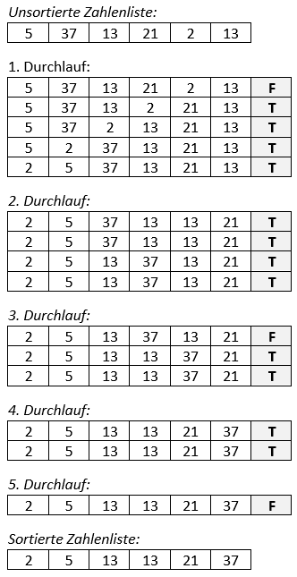

# Bubblesort

## 1 Einleitung

Der Sortieralgorithmus Bubblesort (Blasensortierung) arbeitet nach dem Prinzip, dass sas Feld durchlaufen wird, und dabei so geatauscht wird, dass das grösste bzw. kleinste Element an der richtigen Stelle steht.

## 2 Aufgabenstellung

Schreiben Sie ein C-Programm, welches diesen Sortieralgorithmus verwendet.

Folgende Richtlinien müssen dabei eingehalten werden:

* Der Sortieralgorithmus wird als Unterprogramm im Hauptprogramm aufgerufen.
* Es sollen 100 Zahlen sortiert werden, welche in einem Array zur Verfügung gestellt werden.
* Das Array darf als globale Zahlentabelle im Unterprogramm verwendet werden, sofern die Kenntnis der Übergabe eines Arrays in ein Unterprogramm fehlen.
* Die zu sortierenden Zahlenwerte (Zufallszahlen) sollen mittels des Random-Befehls **rand()** erzeugt und in ein Array eingefügt werden.
* Auf dem Bildschirm sollen die unsortierten und sortieren Zahlenwerte in zwei voneinander getrennten Tabellen dargestellt werden.

## 3 Schwerpunktgebiete dieser Aufgabe

* Funktionen
* Schleifen

## 4 Geforderte Lösungsbereiche

* Struktogramm des Programms
* Programmcode
