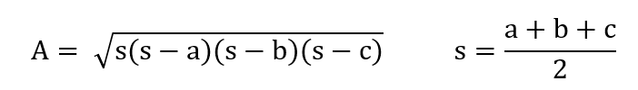

# Dreiecksfläche berechnen

## Bereich

* Eingabe / Ausgabe
* Mathematische Ausdrücke

## Beschreibung

Mit dieser Aufgabe soll ein kleines, vollständiges Programm zur Dreiecksberechnung erstellt werden.

## Aufgabe

Von einem beliebigen Dreieck kann die Fläche aus den drei Seiten wie folgt berechnet werden:



Erstellen Sie ein kleines, vollständiges Programm, welches die drei Seiten einliest und dann daraus die Fläche berechnet und formatiert ausgibt!

*Beispielausgabe:*

```none
Dieses Programm berechnet aus den drei Seiten eines beliebigen Dreiecks deren Flaeche
  bitte die drei Seiten a b c [mm]
  durch einen Leerschlag getrennt eingeben: 22 24 26
Hier das Ergebnis :
  Seite a = 22 [mm]
  Seite b = 24 [mm]
  Seite c = 26 [mm]
  Flaeche = 245.927 [mm^2]
```
